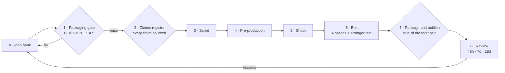

# 07 · Production workflow

> A system beats inspiration. One long-form video and three to five Shorts a week, with three videos always in flight at different stages, and gates that stop weak ideas before they cost a shoot day.

---

## 1. The team

The lean version is three people plus freelancers. One person can hold two roles, but not the host and the fact-checker for the same video.

| Role | Owns | Also does |
|---|---|---|
| **Host / Producer** | On-camera delivery, practitioner relationships, shoot days | Books locations; runs the Thumbnail Minute |
| **Editor** | Assembly, the four retention passes, motion graphics, captions | Cuts Shorts from every long-form video |
| **Research and Packaging lead** | The idea bank, the CLICK gate, the claims register, titles, thumbnail briefs, analytics | Runs Test & Compare; writes the post-mortems |
| *Thumbnail designer (freelance, optional)* | Final thumbnails from the brief | Keeps the badge templates |
| *Production coordinator (freelance, for Change One Thing)* | Casting, consent, the six-week schedule, wellbeing check-ins | Keeps the release log |

---

## 2. The pipeline

Each long-form video moves through eight stages. A video can't enter the next stage until it passes the gate at the end of the current one.

| Stage | When | Owner | Output | Gate (definition of done) |
|---|---|---|---|---|
| **0 · Idea bank** | Continuous | Research lead | A row per idea in the bank | Has a series, a viewer and a central question |
| **1 · Packaging** | Week −3 | Research lead + Host | Ten titles and three thumbnail sketches | CLICK ≥ 20/25 **and** K = 5 ([02-packaging.md](02-packaging.md#2-the-click-score)) |
| **2 · Claims register** | Week −3 | Research lead | [templates/claims-register.md](templates/claims-register.md) filled in | Every factual claim has a primary source, or it's cut |
| **3 · Script** | Week −2 | Host | A script from [templates/script-template.md](templates/script-template.md) | Table read done, 20% cut, hook QA passed ([03-hooks-and-openings.md](03-hooks-and-openings.md#6-hook-qa-checklist)) |
| **4 · Pre-production** | Week −2 | Host / Producer | Bookings, releases, safety plan, shot list | Everything in §5 is signed and confirmed |
| **5 · Shoot** | Week −1 | Host / Producer | Footage, Thumbnail Minute stills, diary-camera answers | Every **[CAPTURE]** in the script is ticked |
| **6 · Edit** | Weeks −1 to 0 | Editor | Fine cut, captions, graphics, Shorts cuts | Four passes and the stranger test done ([04-story-and-retention.md](04-story-and-retention.md#part-3--the-retention-edit-four-passes)) |
| **7 · Package and publish** | Week 0 | Research lead | Final title and thumbnails, description, chapters, pinned comment, end screen | [templates/publish-checklist.md](templates/publish-checklist.md) complete |
| **8 · Review** | 48 hours, 7 days, 28 days | Research lead | A post-mortem ([templates/post-mortem.md](templates/post-mortem.md)) | Lessons written into the Packaging Log and the idea bank |

### Where ideas come from

| Use | Never use |
|---|---|
| YouTube search autocomplete, and YouTube Studio's research and inspiration tools | OffLadder users' answers or Laddie conversations. The product promises that answers are used to help users explore *"and nothing else."* |
| Comments on our videos (especially the Hobby → Verb and Delete One Part series) | Private messages, unless the sender explicitly offers the idea |
| offladder.com's Answers pages and its index of emerging directions | Anyone's story without their signed consent |
| The casting form | |
| Practitioners' own suggestions ("you should film my colleague who…") | |

---

## 3. The weekly rhythm

Three videos are always in flight. In any given week the team publishes video **N**, edits **N+1**, shoots **N+2**, and packages and researches **N+3**.

| Day | Morning | Afternoon |
|---|---|---|
| **Mon** | 48-hour review of last week's video; 7-day review of the one before | Packaging meeting for N+3: ten titles, three sketches, CLICK score |
| **Tue** | Claims register and script for N+2 | Pre-production calls and bookings for N+2 |
| **Wed** | **Shoot day** for N+2 (or a Shorts batch day) | Shoot, continued; Thumbnail Minute; release forms filed |
| **Thu** | Edit N+1: story and tension passes | Edit N+1: rhythm and clarity passes; the stranger test |
| **Fri** | Publish N (the time that suits your audience, then keep it consistent) | Pinned comment, reply to comments for the first hour, schedule the week's Shorts |

**Batching saves days:**
- **Honest Answers:** shoot two in one day at the same location.
- **Shorts:** one half-day street or practitioner session produces six to ten Delete One Part and Hobby → Verb Shorts.
- **90 Minutes As…:** one per shoot day. Never double up, because the host's energy is the product.
- **Change One Thing:** runs in parallel on its own six-week schedule, owned by the production coordinator.

---

## 4. Working with practitioners

Practitioners are the channel's most valuable resource. Treat them that way.

- **Finding them:** professional associations, local businesses, OffLadder's own network, LinkedIn, and practitioners from earlier episodes recommending colleagues.
- **The ask:** *"We're making an honest video about what your work is really like, including the parts people don't post. It takes one afternoon, we pay for your time, and you'll see the cut to check that the technical details are right."*
- **What they get:** a fee, a credit and link in the description, and a clip they're free to use.
- **What they review:** factual and technical accuracy, and anything that could get them in trouble at work. **Not** editorial control, and we say so at the first conversation.
- **Their employer:** get written permission when filming at work or talking about work processes. Blur screens, client names and badges by default.

---

## 5. Safety, consent and safeguarding

| Area | Rule |
|---|---|
| **Releases** | Everyone identifiable on camera signs a release before filming. Keep a release log per video. |
| **Locations** | Written permission for every non-public location. Follow the venue's safety induction. |
| **Minors** | No minors on camera by default (use POV skits and adult actors). If an exception is ever made: written parental consent, no school names or locations, active comment moderation, and the knowledge that YouTube may restrict features, including comments, on the video ([YouTube child safety policy](https://support.google.com/youtube/answer/2801999)). |
| **Viewer experiments** | Every Your Version must be safe for a 13-year-old: 15–90 minutes, no money, no strangers without a trusted adult, stop whenever. |
| **Risky activities** | Drones: a licensed operator flies, under local aviation rules. Tools, batteries, mains power, heights, labs: a qualified practitioner leads, and the host follows their safety briefing on camera. |
| **Workplace confidentiality** | Blur screens, documents, customer or patient details and badges. No patient, client or pupil information, ever. |
| **Wellbeing** | Check-ins on every Change One Thing shoot. Stop filming when asked. Signpost support. |
| **Synthetic media** | Label realistic AI-generated or altered media on screen, and tick YouTube's disclosure ([YouTube Help](https://support.google.com/youtube/answer/14328491)). |
| **Comments** | Turn on "hold potentially inappropriate comments for review". Keep a blocked-words list that includes scam contact bait ("DM me", "WhatsApp", "Telegram"). Never ask viewers for their school, location or contact details. |
| **Casting data** | Collect only what casting needs. Delete unsuccessful applications after the casting round, and say so on the form. |

---

## 6. Brand look in the edit

| Element | Spec |
|---|---|
| **Typefaces** | Archivo Black (display, uppercase) · Hind (captions, lower-third body) · Instrument Serif Italic (rare asides) |
| **Colour** | Orange `#FA5608` is the only accent. Ink `#0C0C0C`, paper `#F4F2EE` |
| **Shapes** | Square corners, and hard ink offset shadows on every card |
| **Lower third** | Name in Archivo Black, role in Hind, orange block on the left edge |
| **Clock** | 90 Minutes As… only: top-left, orange block, ink numerals. It always shows the real time remaining. |
| **Scorecard** | Three questions as a checklist on a paper card; each ticks when answered |
| **Verdict stamp** | An orange rubber-stamp texture: MORE / VARIANT / OFF THE TABLE, with a thud sound effect and two seconds of silence before it |
| **Evidence Card** | Paper card with ink text: ORGANISATION · Report · Year. It stays on screen long enough to read. |
| **Your Version card** | Paper card with three numbered lines |
| **Transitions** | Hard cuts. No spins, swipes or zoom transitions. |
| **Music** | Sparse. Nothing under key dialogue, and nothing under the verdict. |
| **Captions** | Corrected, never raw auto-captions. Burned in for Shorts; uploaded as a caption file for long-form. |

**Accessibility:** say the answer aloud whenever a visual reveals it (real or AI, the verdict), keep text contrast high, avoid flashing effects, and upload corrected captions for every long-form video.

---

## 7. Minimum kit

| Item | Why |
|---|---|
| A mirrorless camera or a recent phone, plus a second angle | Experiments need a wide shot and a close-up |
| Two wireless lavalier mics | Viewers forgive soft pictures; they don't forgive bad sound |
| One LED panel with a softbox | Consistent kitchen-table and office lighting |
| A tripod, a gimbal and an overhead rig | Top-down shots of writing and building are a signature look |
| Screen-recording software | Honest Answers and AI demos |
| A physical countdown timer | The on-set truth behind the 90:00 clock |
| An orange ink stamp, paper cards and sticky notes | Brand props that carry into thumbnails |
| Licensed music and sound-effects library | The tick, the thud, and occasional beds |

---

## 8. Templates

All in [templates/](templates/):

| Template | Used at |
|---|---|
| [concept-card.md](templates/concept-card.md) | Stage 1, when an idea enters packaging |
| [claims-register.md](templates/claims-register.md) | Stage 2 |
| [script-template.md](templates/script-template.md) | Stage 3 |
| [thumbnail-brief.md](templates/thumbnail-brief.md) | Stages 4 and 7 |
| [release-and-safety-checklist.md](templates/release-and-safety-checklist.md) | Stage 4 |
| [publish-checklist.md](templates/publish-checklist.md) | Stage 7 |
| [packaging-log.md](templates/packaging-log.md) | Stages 7 and 8 |
| [post-mortem.md](templates/post-mortem.md) | Stage 8 |
