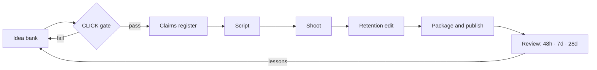

# OffLadder YouTube Playbook

A complete system for producing YouTube videos for [offladder.com](https://offladder.com) that people click and watch to the end, without breaking the honesty the brand is built on. It covers strategy, packaging, hooks, story structures, retention techniques and CTAs, plus a slate of 22 long-form concepts and 24 Shorts, seven full long-form scripts, twelve Shorts scripts, a production workflow, analytics, and a 90-day launch plan.

---

## The strategy in 60 seconds

- **The insight.** OffLadder's method (*try a small, real piece of a career before you choose one*) is already one of YouTube's most dependable formats: the on-camera experiment. **The channel films the method**, so the product appears in every episode without an ad break.
- **The promise.** *Every week we test a real piece of a job, so you can find out what fits without betting years on a guess.*
- **The gap.** Career YouTube is crowded with salary lists, "AI-proof jobs" lists, glossy day-in-the-life vlogs and advice with nothing to do. We film the hour of work, the worst week, the part people would delete, and an experiment viewers can run this week.
- **The series.** **90 Minutes As…** (experiments, for reach) · **Last Tuesday** (honest hour-by-hour) · **The Job Nobody Told You About** (emerging directions) · **Change One Thing** (six-week career-change documentaries) · **Honest Answers** (search-led) · **Shorts** (Delete One Part, Hobby → Verb, The Pause, Real or Not?).
- **The signature.** Every experiment ends with the **Scorecard** (*which twenty minutes went fastest? what did I put off? would I do it again next week?*), a **Verdict** stamp (**MORE / VARIANT / OFF THE TABLE**), and **Your Version**, a safe experiment the viewer can run.
- **The rule.** Curiosity drives clicks, never exaggeration. No invented statistics, no AI-proof lists, no salary bait, and every title is true of the footage. YouTube picks A/B-test winners by watch time and weighs viewer satisfaction, so honest packaging compounds.

---

## What's inside

| File | What it gives you | Main user |
|---|---|---|
| [01-strategy.md](01-strategy.md) | Channel thesis, audiences, the format portfolio, signature devices, guardrails, funnel and KPIs | Everyone, first |
| [02-packaging.md](02-packaging.md) | The CLICK greenlight score, ten title formulas, a thumbnail system on OffLadder's brand tokens, the Test & Compare protocol | Packaging lead, designer |
| [03-hooks-and-openings.md](03-hooks-and-openings.md) | The four jobs of the first 30 seconds, twelve hook archetypes, five opening blueprints, a bank of 32 hooks | Host, editor |
| [04-story-and-retention.md](04-story-and-retention.md) | Six story structures with beat timings, 22 retention techniques, the four-pass edit, reading the retention graph | Host, editor |
| [05-ctas.md](05-ctas.md) | The CTA ladder, placement by series, a line bank, description and pinned-comment templates, end screens, UTM tracking | Host, packaging lead |
| [06-video-slate.md](06-video-slate.md) | 22 long-form concepts and 24 Shorts, each with titles, thumbnails, hook, opening, structure, and why they'd click and stay | Everyone |
| [scripts/](scripts/) | Seven long-form shooting scripts, twelve Shorts scripts, **[the AI-and-work Shorts series](scripts/ai-series.md)**, and **[Cooked or not?](scripts/cooked-or-not.md)**, the verdict series that runs from Short 6, each with its claims register | Host, editor |
| [07-production-workflow.md](07-production-workflow.md) | Team, the eight-stage pipeline with gates, weekly rhythm, safeguarding, brand look, kit | Producer |
| [08-analytics.md](08-analytics.md) | The scoreboard, diagnosis matrix, review cadence, decision rules, funnel measurement, experiment backlog | Packaging lead |
| [09-launch-plan.md](09-launch-plan.md) | Research sprint, channel set-up, trailer script, the 12-week calendar and checkpoints | Producer |
| [templates/](templates/) | Concept card, claims register, script, thumbnail brief, release and safety checklist, publish checklist, packaging log, post-mortem | Everyone |
| [launch/](launch/) | **What's been made and scheduled:** the launch log, the AI series (live and queued in Metricool), the motion engine that renders it, channel art, and the search-language research | Everyone |

---

## How the system runs

Three videos are always in flight. Each week the team publishes one video, edits the next, shoots the one after that, and packages the fourth. Details are in [07-production-workflow.md](07-production-workflow.md).

---

## Start this week

1. **Read [01-strategy.md](01-strategy.md)** as a team, and agree the guardrails in §6. They're non-negotiable.
2. **Run the research sprint** in [09-launch-plan.md](09-launch-plan.md#week--4-research-sprint), and adjust the launch titles to the language you find.
3. **Have the host take OffLadder's three questions on camera.** The result decides whether script 02 is the right pilot.
4. **Book a practitioner** for the pilot, and set up the channel using the checklist.
5. **Table-read scripts [01](scripts/01-i-dont-know-what-career-i-want.md), [02](scripts/02-90-minutes-live-event-producer.md) and [03](scripts/03-stop-asking-which-jobs-ai-cant-replace.md).** These three are the launch library.

---

## Platform facts this playbook relies on

Checked against YouTube's own documentation in September 2026. Re-check before launch, because platforms change.

| Fact | Source |
|---|---|
| Half of all channels and videos have an impressions CTR between 2% and 10% | [YouTube Help: Impressions and CTR](https://support.google.com/youtube/answer/7628154) |
| Test & Compare tests up to three titles, thumbnails or combinations, and picks the winner by watch time | [YouTube Help: A/B test titles and thumbnails](https://support.google.com/youtube/answer/16391400) |
| Recommendations weigh "valued watchtime", measured partly through viewer surveys | [YouTube Blog: On YouTube's recommendation system](https://blog.youtube/inside-youtube/on-youtubes-recommendation-system/) |
| The "Intro" key moment is the share of viewers still watching after 30 seconds | [YouTube Help: Key moments for audience retention](https://support.google.com/youtube/answer/9314415) |
| Shorts can be up to three minutes long | [YouTube Help: Three-minute Shorts](https://support.google.com/youtube/answer/15424877) |
| Links in Shorts descriptions and comments aren't clickable; use related-video links | [YouTube Help: Sharing links with your audiences](https://support.google.com/youtube/answer/13748639) |
| Since 31 March 2025, Shorts views count every start or replay; "engaged views" keeps the old definition | [YouTube announcement](https://support.google.com/youtube/thread/333869549/a-change-to-how-we-count-views-on-shorts) |
| Chapters need a 00:00 start, at least three timestamps, and chapters of at least 10 seconds | [YouTube Help: Video chapters](https://support.google.com/youtube/answer/9884579) |
| End screens need a video of 25 seconds or more, sit in the last 5–20 seconds, and hold up to four elements | [YouTube Help: End screens](https://support.google.com/youtube/answer/6388789) |
| Realistic altered or synthetic content must be disclosed | [YouTube Help: Disclosing altered or synthetic content](https://support.google.com/youtube/answer/14328491) |
| Features, including comments, may be restricted on videos featuring minors | [YouTube Help: Child safety policy](https://support.google.com/youtube/answer/2801999) |

Everything about OffLadder itself (the product loop, Laddie, the constellation, the audiences, the editorial rules, the brand colours and type) comes from offladder.com as published in September 2026.

---

## House style and flags

- Written in **British English**, to match offladder.com.
- In scripts, **[HOST: real]** marks lines that must be replaced with the host's true experience, **[FACT-CHECK]** marks claims that need a primary source before recording, and **{curly braces}** mark values that only exist after research or filming. The full conventions are in [scripts/README.md](scripts/README.md).
- Working titles and hooks that describe a specific person are placeholders until someone is cast.
